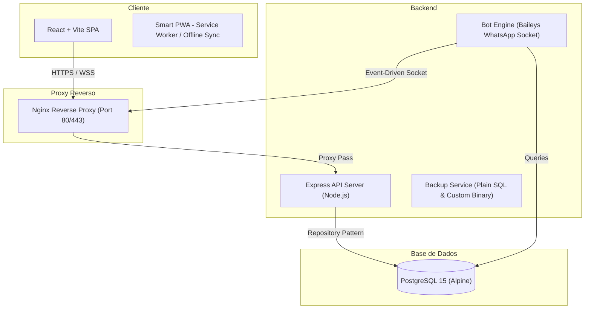

# 🚀 LNSOTECH Automation CRM v2 (KUMBUKA CRM)

[]()
[]()
[]()
[]()
[]()

> Sistema corporativo moderno de automação e CRM com integração WhatsApp (Multi-Bot), projetado sob os mais rígidos padrões de engenharia de software para garantir alta resiliência, escalabilidade e segurança.

---

## 📌 Índice

- [🏗️ Arquitetura do Sistema](#️-arquitetura-do-sistema)
- [🛠️ Funcionalidades Principais](#️-funcionalidades-principais)
- [⚡ Stack Tecnológica](#-stack-tecnológica)
- [⚙️ Configuração e Variáveis de Ambiente](#️-configuração-e-variáveis-de-ambiente)
- [🚀 Desenvolvimento Local (Modo Rápido)](#-desenvolvimento-local-modo-rápido)
- [🌐 Guia de Deploy em Produção (VPS)](#-guia-de-deploy-em-produção-vps)
- [🛡️ Resiliência, Segurança & Estabilização](#️-resiliência-segurança--estabilização)
- [📁 Estrutura de Diretórios](#-estrutura-de-diretórios)

---

## 🏗️ Arquitetura do Sistema

O ecossistema é baseado numa arquitetura de **Microserviços Contenerizados** via Docker, dividida em três camadas principais estruturadas da seguinte forma:



### Detalhamento das Camadas

*   **Backend (Node.js + Express):** Segue o padrão arquitetural **MVC (Model-View-Controller)** com uma **Service Layer** acoplada para execução de lógica pesada de negócio (ex: backups) e um padrão **Repository** para o isolamento de queries SQL do banco.
*   **Frontend (React 18 + Vite):** Uma Single Page Application (SPA) moderna, reativa, que utiliza **Custom Hooks** para abstração de lógica de estado (Auth, BotStatus, OfflineSync, Eventos, Temas) e componentes limpos.
*   **Infraestrutura (Docker + Nginx):** O Nginx atua como proxy reverso gerenciando o tráfego HTTP e conexões WebSocket para o Bot Engine de forma totalmente isolada em rede docker bridge.

---

## 🛠️ Funcionalidades Principais

| Funcionalidade | Descrição | Tecnologia Utilizada |
| :--- | :--- | :--- |
| **Multi-Bot WhatsApp** | Conexão simultânea de múltiplos números e tratamento reativo de conexões. | Baileys Engine (Socket) |
| **Live Template Editor** | Editor de mensagens avançado com visualização simulada de smartphone e variáveis. | React + SweetAlert2 |
| **Smart PWA** | Web App instalável com cache offline completo de estatísticas e eventos. | Service Worker + Workbox |
| **Fila de Envio Inteligente** | Processamento com *Rate Limiting* e delay dinâmico para evitar banimentos. | PostgreSQL Queue + Sleep Helper |
| **Autenticação 2FA** | Segurança robusta baseada no protocolo TOTP (RFC 6238). | `otplib` + JWT |
| **Backups Compatíveis** | Exportações Plain SQL e Binary para migrações flexíveis entre versões do BD. | Custom SQL Generators |
| **Logs de Auditoria** | Histórico imutável de todas as modificações críticas do sistema por usuário. | Audit Log Repository |

---

## ⚡ Stack Tecnológica

*   **Linguagens & Frameworks:** Node.js v20+, Express, React 18, Vite.
*   **Banco de Dados:** PostgreSQL 15-alpine (com volumes persistentes locais).
*   **Estilização & Iconografia:** Vanilla CSS premium (harmonia HSL, dark/light mode nativo) e Lucide React.
*   **Proxy & Servidor Web:** Nginx Alpine.
*   **Containers:** Docker & Docker Compose.

---

## ⚙️ Configuração e Variáveis de Ambiente

Crie um arquivo `.env` no diretório raiz com as seguintes configurações básicas:

```env
# Banco de Dados
DB_USER=seu_usuario
DB_PASSWORD=sua_senha
DB_NAME=lnsotech_db
DB_HOST=database
DB_PORT=5432

# Segurança
JWT_SECRET=sua_chave_secreta_jwt
TWO_FACTOR_SECRET_KEY=sua_chave_secreta_totp

# Configurações do Bot
PORT=3000
NODE_ENV=production
```

---

## 🚀 Desenvolvimento Local (Modo Rápido)

Para iniciar o sistema em modo de desenvolvimento com suporte a **Hot-Reload** no frontend e backend:

1. Garanta que tem o Docker instalado na sua máquina.
2. Execute o comando:
   ```bash
   docker-compose up --build
   ```
3. O frontend estará disponível em [http://localhost:3001](http://localhost:3001).
4. O painel de administração de banco de dados **pgAdmin** estará ativo em [http://localhost:5050](http://localhost:5050).

---

## 🌐 Guia de Deploy em Produção (VPS)

O deploy é projetado em **3 passos profissionais** para validação segura:

### 1. Desenvolvimento e Testes Locais
Execute e valide as novas implementações localmente:
```bash
docker-compose up --build
```

### 2. Validação Homologada (Simulação Real da VPS)
Rode a stack configurada exatamente como rodará em nuvem (sem ferramentas adicionais de debug e sob otimização de Nginx de produção):
```bash
docker-compose -f docker-compose.yml up --build
```
Se a aplicação abrir com sucesso, ela está pronta e livre de erros ambientais para ir à VPS (ex: Contabo).

### 3. Deploy Automático via CI/CD
Envie as alterações para a branch principal:
```bash
git push origin main
```
O **GitHub Actions** assumirá o fluxo:
* Conecta-se à VPS via SSH.
* Executa um backup de segurança preventivo da base PostgreSQL.
* Realiza o `git pull` e faz o rebuild inteligente dos containers em produção.

---

## 🛡️ Resiliência, Segurança & Estabilização

*   **Anti-Spam & Throttling:** Algoritmo sequencial de envio que respeita pausas assíncronas calculadas (`sleep`) e ignora auto-mensagens (`fromMe`) para proteger o chip de suspensões no WhatsApp.
*   **TOTP 2FA:** Segurança adicional de login que exige verificação física no dispositivo gerador de código sem depender de conexões de internet.
*   **Robustez de Dados:** Rotinas automatizadas de migração de dados e compatibilidade assegurada de exportações.

---

## 📁 Estrutura de Diretórios

```text
lnsotech-automation/
├── .github/                   # Workflows do GitHub Actions
├── Bot/                       # Microsserviço do motor de bots auxiliar
├── docker/                    # Configurações de serviços (Nginx, etc.)
├── lnsotech-events-v2/        # Core do Ecossistema CRM
│   ├── backend/               # Servidor Express, Controladores e Repositórios
│   │   └── src/               # Código fonte (MVC + Services)
│   └── frontend/              # Single Page Application React
│       └── src/               # Componentes, Páginas, Hooks e Assets
├── postgres/                  # Scripts SQL de inicialização e migrações
├── docker-compose.yml         # Orquestrador de serviços
└── README.md                  # Este documento
```

---
*LNSOTECH Automation CRM - Projetado com dedicação e engenharia de precisão.*
